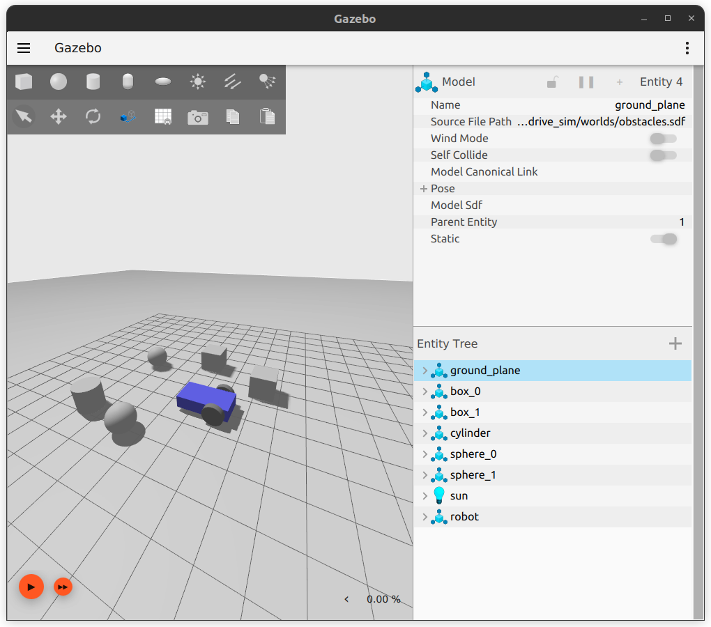

# diff_drive_sim

A package to demonstrate a simple differential drive robot simulation in Gazebo integrated with ROS2.



## How to use

1. Create a ROS2 workspace and clone this repository into the `src` folder:

    ```bash
    mkdir -p ~/ros2_ws/src
    cd ~/ros2_ws/src
    git clone https://github.com/ShravanDeva5327/diff_drive_sim.git
    ```

2. Navigate to the workspace root and build the package:

    ```bash
    cd ~/ros2_ws
    colcon build
    ```

3. Source the workspace:

    ```bash
    source ~/ros2_ws/install/setup.bash
    ```

4. Launch the simulation:

    ```bash
    ros2 launch diff_drive_sim diff_drive_sim.launch.py
    ```

5. To Move the robot, run the following commands in 2 separate terminals:

    ```bash
    ros2 topic pub /left_wheel/cmd_vel std_msgs/msg/Float64 "data: 2.0"
    ```

    ```bash
    ros2 topic pub /right_wheel/cmd_vel std_msgs/msg/Float64 "data: -2.0"
    ```

    **DO NOT FORGET TO PRESS THE PLAY BUTTON IN THE BOTTOM LEFT CORNER OF GAZEBO BEFORE RUNNING THESE COMMANDS, ONLY THEN THE ROBOT WILL MOVE.**

    See [TODO](#todo).

## TODO

1. Add ROS 2 nodes to control the robot using keyboard.
2. Add Sensors like LIDAR, Camera, IMU, etc.
3. Add ability to visualize sensor data in RViz.